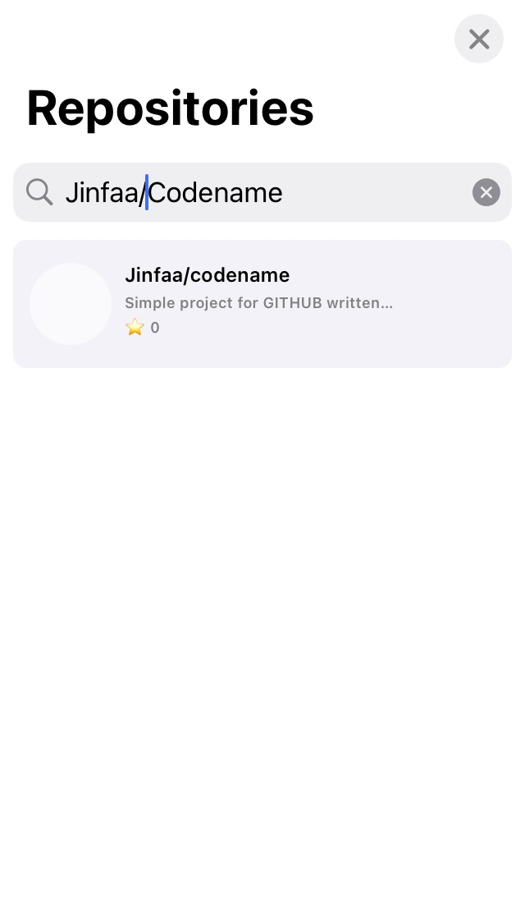
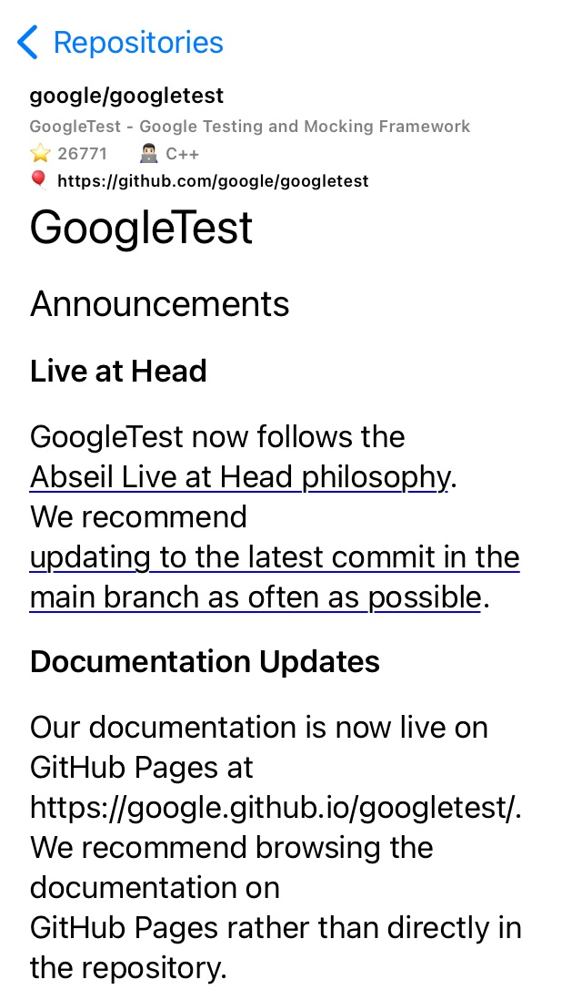

# CodeName
Реализация простого приложения для поиска репозиториев github. В проекте использовалась архитектура VIPER. 

В проекте использовался OAuth. Прменение базовой авторизации логин + пароль невозможна. 

Поясненение:
`Support for password authentication was removed on August 13, 2021. Please use a personal access token instead.
remote: Please see https://github.blog/2020-12-15-token-authentication-requirements-for-git-operations/ for more information.`

<pre>
  
</pre>

## Установка
1) Вызвать команду: `pod install`
2) Открыть: `CodeName.xcworkspace`
3) Указать в `AppDependencyContainer` clientId и clientSecret

## Зависимости
* Texture framework (https://texturegroup.org)
* SwiftyMarkdown
* KeychainAccess

## TODO
* Загрузка изображений .svg
* Добавить показ ошибок
* Общая навигация между модулями
